# MoFIN 💴
- 금융 데이터를 활용한 예적금 금융 상품 비교 애플리케이션

    

## 📍 프로젝트 기간
- 2024.05.16(목) ~ 2024.05.24(금)

 

## 🏆프로젝트 성과
- 삼성 청년 SW 아카데미 관통프로젝트 우수상
  
    

## 🖥️ 개발 환경

### 🐳 Backend

 
    
  

 

### 🦊 Frontend

    
  
  
  
  

 

### 🗂️ DB

    

 

### 🔨 Tools 

    
 

    

## 🎯 설계 내용 및 실제 구현 정도
| No | 구분               | 기능                                           | 구현 정도  |
|----|--------------------|------------------------------------------------|------------|
| 1  | 메인페이지         | 네비게이션 바, 상품 광고 캐러셀, 최신 게시글 5개 노출 | ⭐⭐⭐⭐⭐    |
| 2  | 회원 커스터마이징  | 회원가입/탈퇴 및 로그인/로그아웃 기능 구현     | ⭐⭐⭐⭐⭐    |
| 3  | 예적금 금리 비교   | 예적금 상품 및 가입 기간별 옵션 조회 / 필터링  | ⭐⭐⭐⭐     |
| 4  | 환율 계산기        | 나라별 환율 정보 조회 및 환율 계산            | ⭐⭐⭐⭐     |
| 5  | 근처 은행 검색     | 카카오맵 API를 이용한 은행 검색                | ⭐⭐⭐⭐⭐    |
| 6  | 커뮤니티           | 게시글, 댓글 CRUD / 좋아요 기능               | ⭐⭐⭐⭐⭐    |
| 7  | 프로필 페이지      | 회원정보 조회 및 수정, 탈퇴 / 금리 비교 그래프  | ⭐⭐⭐⭐⭐    |
| 8  | 금융 상품 추천 알고리즘 | 사용자 데이터를 이용한 예적금 상품 추천          | ⭐⭐⭐⭐⭐    |

    

## 🎞 데이터베이스 모델링 (ERD)
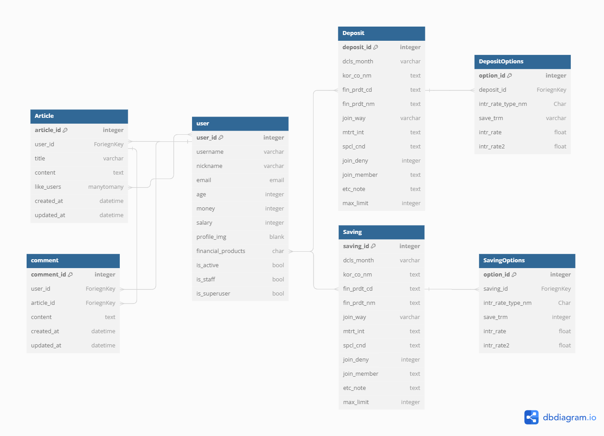

    

## 💵 금융 상품 추천 알고리즘 및 기술적 설명
사용자와 나이, 자산, 연봉이 비슷한 유저들의 데이터를 비교하여 가장 많이 가입한 상품 5개의 코드를 추출하도록 구현.
추출한 상품 코드는 저장해둔 전체 예,적금 상품 코드와 비교하여 은행명, 상품명, 우대 조건이 보이도록 함.

    

## 🎨 서비스 대표 기능들에 대한 설명
- **메인 페이지**
 

 

- **금융 상품 추천** 
  사용자의 나이, 자산, 연봉 정보를 바탕으로 비슷한 조건을 가진 다른 사용자들이 가입한 예적금 상품을 분석하여 추천. 유사한 사용자들의 데이터를 비교하여 가장 많이 가입한 5개의 예적금 상품을 추출하고, 해당 상품의 은행명, 상품명, 우대 조건 등을 사용자에게 제공.
  추천 상품이 없을 시에 예적금 상품 페이지 링크로 이동하도록 페이지 구성.
 

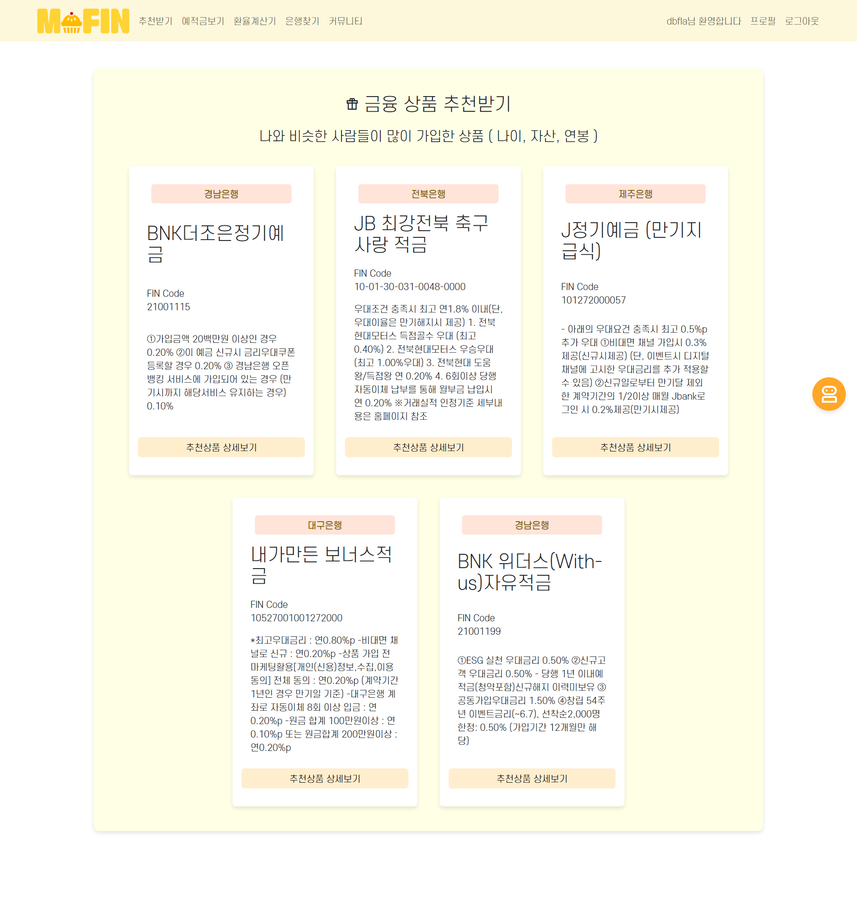
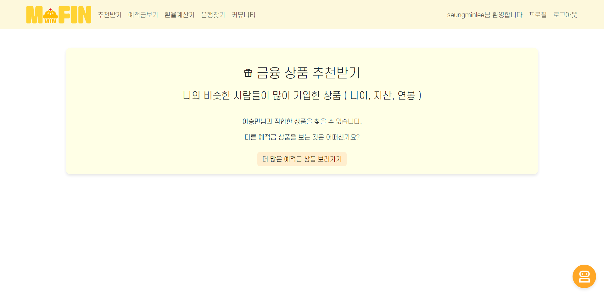

- **예적금 상품 조회** 
  다양한 예적금 상품의 정보를 제공하며, 원하는 은행 또는 기간에 맞는 상품 검색 가능. 가입 시 프로필로 이동할 수 있게 함.

 

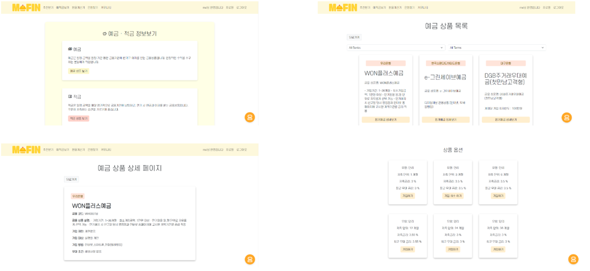
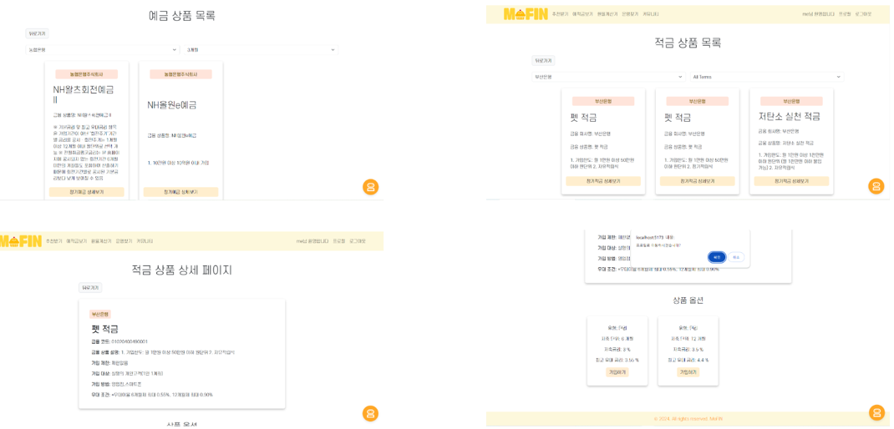

- **은행 위치 검색** 
  카카오맵 API를 활용하여 기능 구현. 사용자의 주변 은행 지점 검색 가능.
 

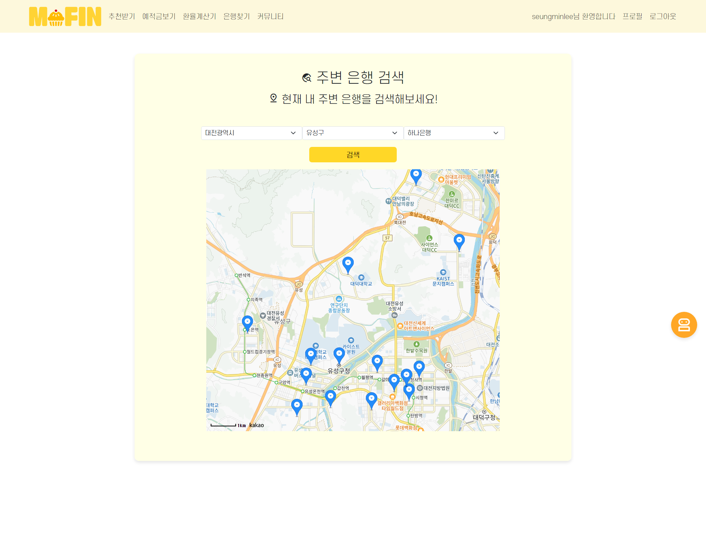

- **환율 계산기** 
  나라별 환율 정보를 제공하고, 사용자가 원하는 금액을 입력하면 해당 금액을 다른 통화로 변환. 환율 정보를 확인 및 환전 시 필요한 금액을 간편하게 계산 가능.
 

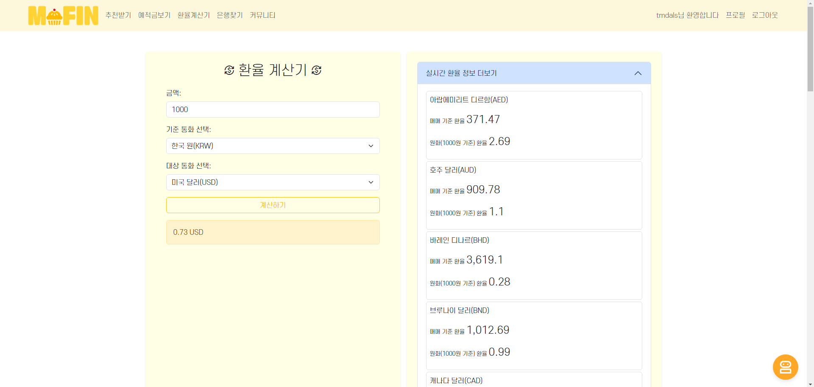
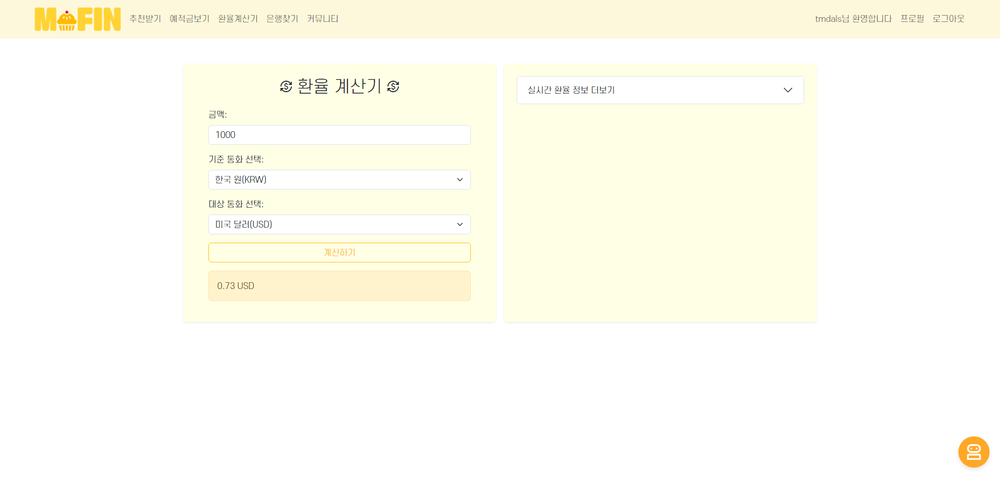
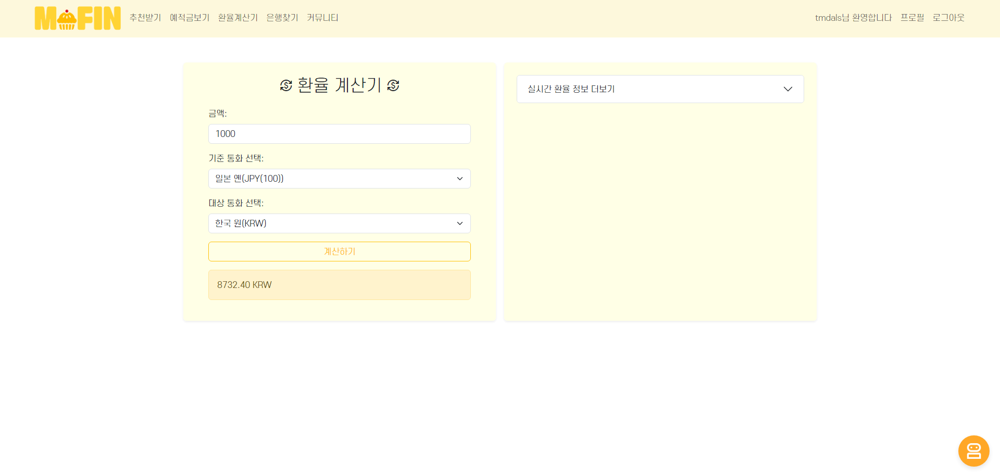

- **챗봇 서비스** 
  메인페이지의 챗봇 버튼 또는 페이지 하단 버튼을 눌렀을 때 챗봇 기능 활성화. ChatGPT API 를 활용하여 질문을 묻고 답하는 기능 구현.
   

- **커뮤니티** 
  게시글 작성, 조회, 수정, 삭제 와 댓글 작성, 조회, 삭제 기능 구현.
  (게시글, 댓글 작성자만 수정, 삭제 가능) 
  커뮤니티 페이지에 게시글 최대 10개 노출. 메인페이지 최신 소식에 최신글 5개 반영. 게시글 좋아요 누르기 가능.

    
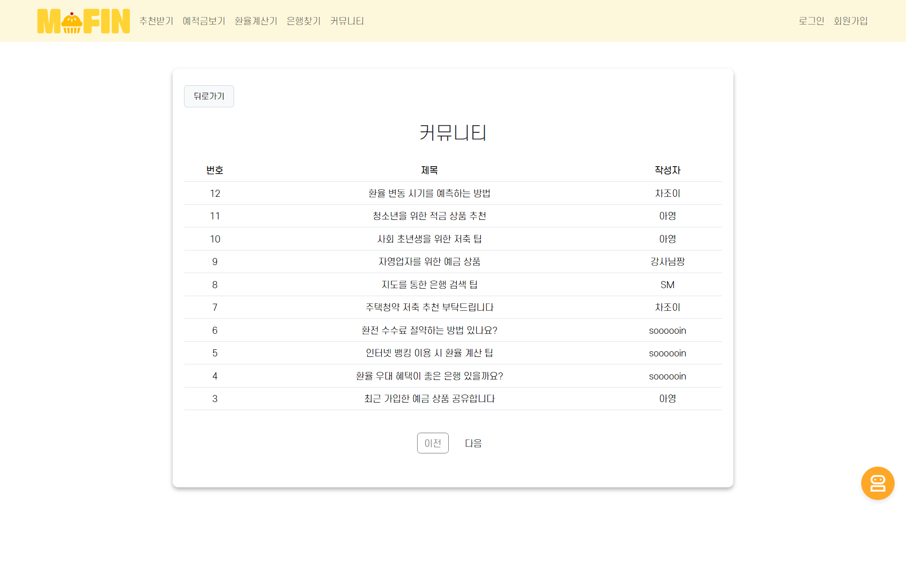
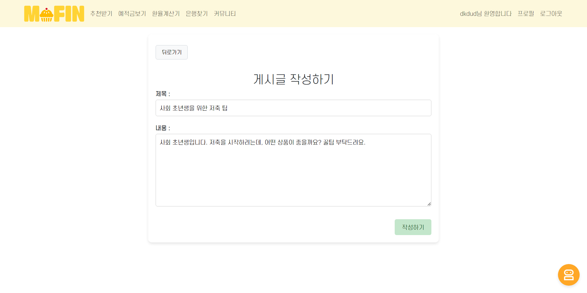
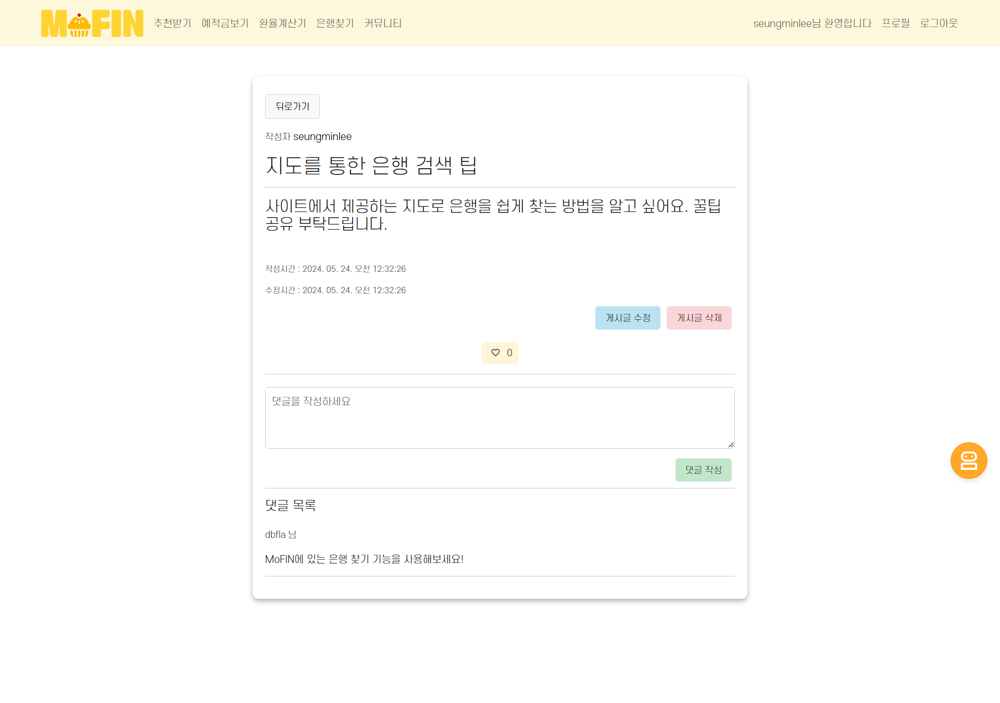
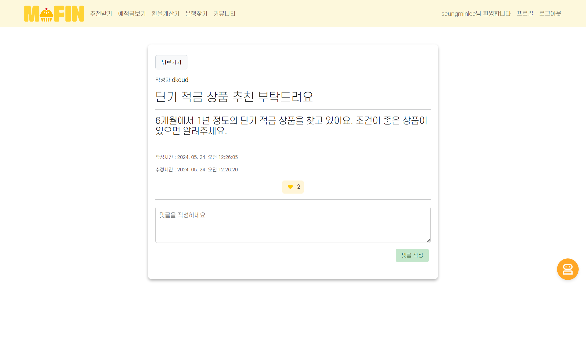

- **로그인/회원가입** 
  로그인 및 회원가입 기능 구현. 회원가입 시 비밀번호가 일치하지 않거나 정보를 모두 입력하지 않을 시 회원가입이 되지 않고 경고문구 띄움.

    
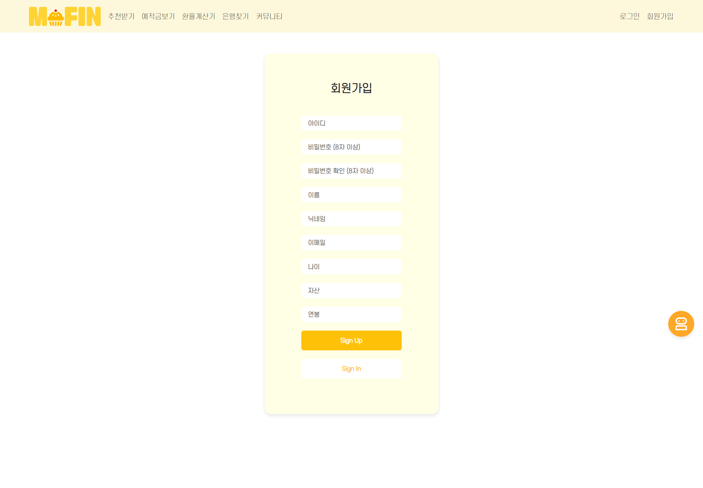
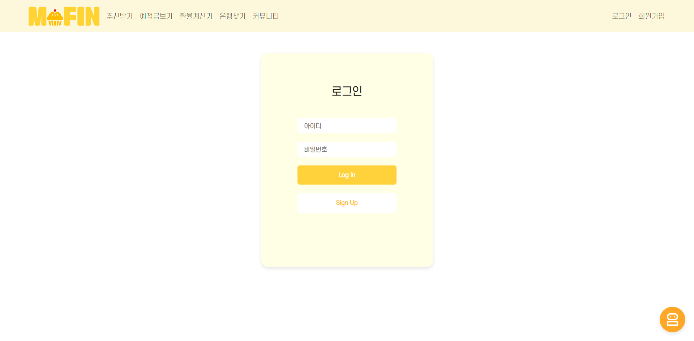

- **프로필 페이지** 
  회원가입시 입력한 정보를 프로필 페이지에서 확인 가능. 회원정보 수정, 비밀번호 변경, 회원 탈퇴 가능. 
  가입한 상품 목록과 가입한 상품의 금리 비교 그래프 출력.
  커뮤니티에서 내가 쓴 글 확인 할 수 있도록 함. 

    
  
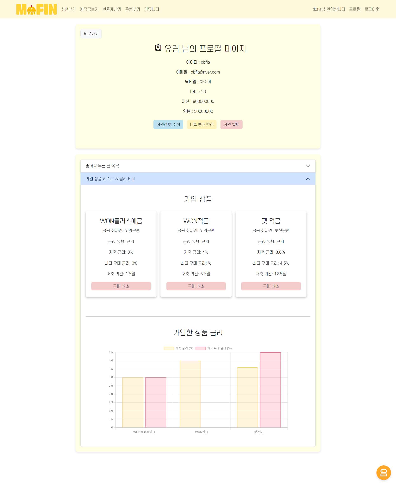
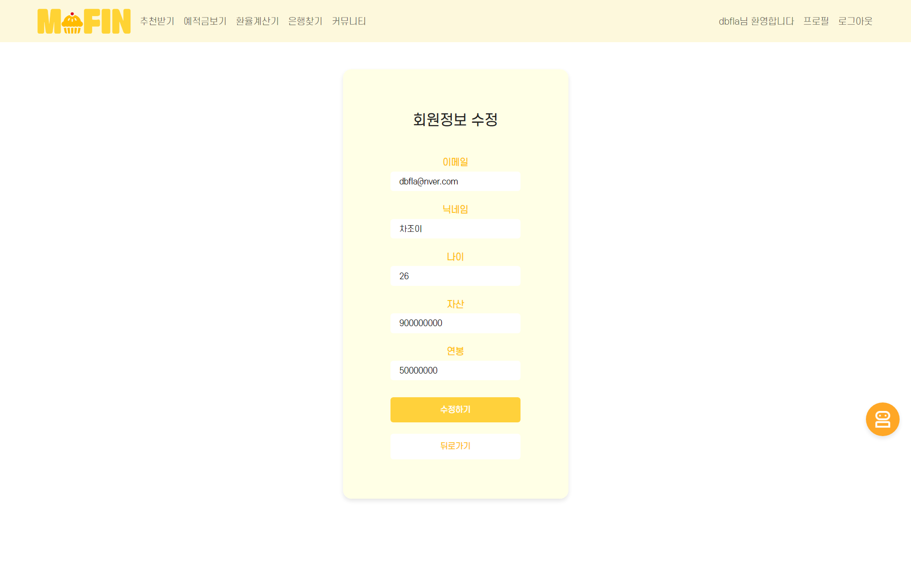

## 👩‍💻  팀원 소개

<table>
    <tr>
      <td align="center">
        
      </td>
      <td align="center">
        
      </td>
  </tr>
  <tr>
    <td align="center">
      <a href="https://github.com/seungminleeee">
        이승민
      </a>
    </td>
    <td align="center">
      <a href="https://github.com/chajoyhoi">
        차유림
      </a>
    </td>
  </tr>
  <tr>
    <td align="center">
        팀장, BE, FE
    </td>
    <td align="center">
        BE, FE
    </td>
  </tr>
</table>

