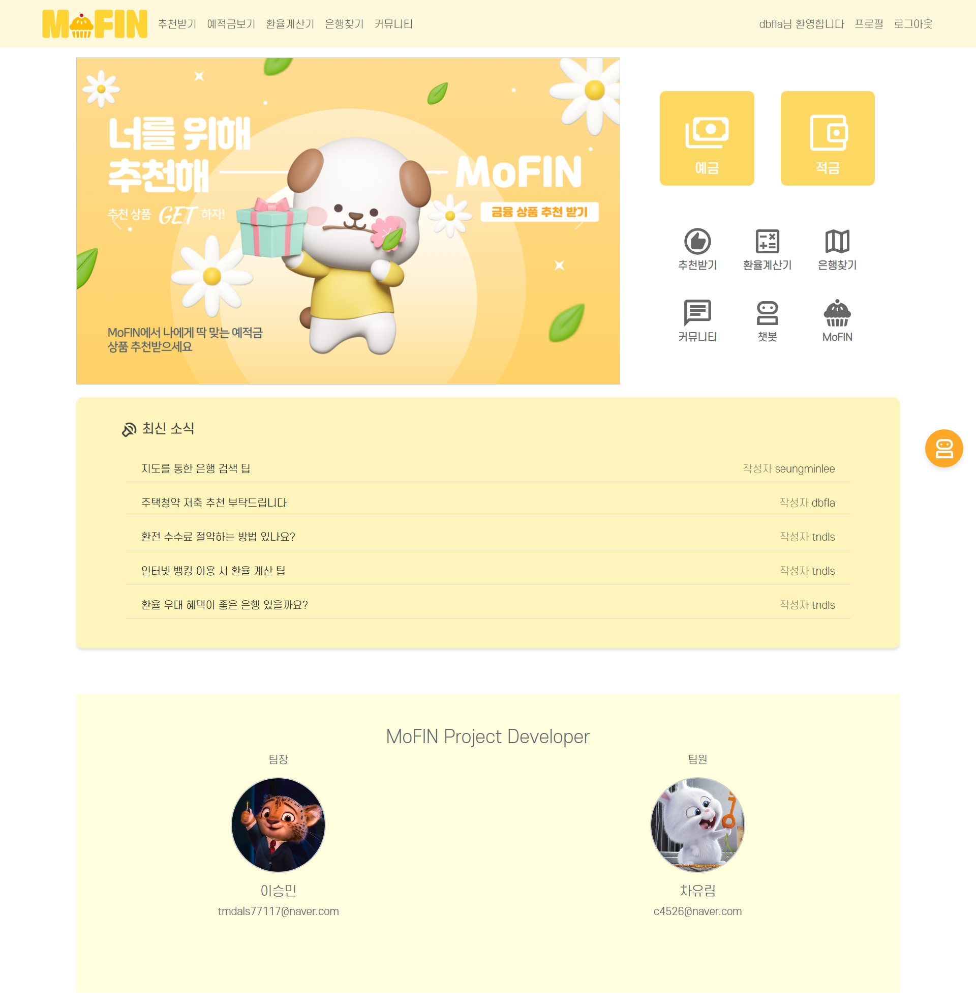
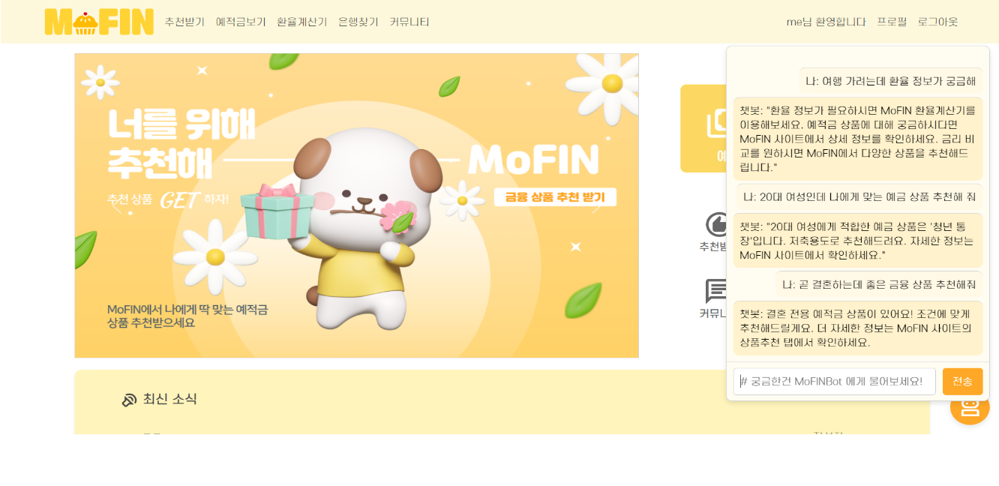

# MoFIN-project

## 📍 프로젝트 개요 
  - 개요 : 금융 데이터를 활용한 금융 상품 비교 애플리케이션
  - 프로젝트 기간 : 2024.05.16(목) ~ 2024.05.24(금)

## 📍 팀원 정보 및 업무 분담 내역
**이승민**
  - 백엔드
    - 게시판, 댓글 CRUD
    - 회원가입, 로그인 구현
    - 금융 알고리즘 설계 및 기능 구현
  - 프론트엔드
    - 게시판, 댓글, 좋아요 페이지
    - 환율 계산기 기능 구현 및 페이지 구현
    - 예적금 상품 조회 페이지
    - 금융 상품 추천 페이지

**차유림**
  - 백엔드
    - 환율 계산기 기능 구현
    - 금융 데이터 저장 및 조회 기능
    - 프로필 페이지 기능 구현
  - 프론트엔드
    - 프로필 페이지
    - 은행 지도 검색
    - 예적금 장바구니 기능
    - 금융 비교 그래프

## 📍 기술 스택
- front
  - Vue3
  - JavaScript

- back 
  - python 
  - django
  - sqlite

- DevOps
  - git

- Tools 
  - notion
  - postman
  - visual studio

## 📍 설계 내용 및 실제 구현 정도
| No | 구분               | 기능                                           | 구현 정도  |
|----|--------------------|------------------------------------------------|------------|
| 1  | 메인페이지         | 네비게이션 바, 상품 광고 캐러셀, 최신 게시글 5개 노출 | ⭐⭐⭐⭐⭐    |
| 2  | 회원 커스터마이징  | 회원가입/탈퇴 및 로그인/로그아웃 기능 구현     | ⭐⭐⭐⭐⭐    |
| 3  | 예적금 금리 비교   | 예적금 상품 및 가입 기간별 옵션 조회 / 필터링  | ⭐⭐⭐⭐     |
| 4  | 환율 계산기        | 나라별 환율 정보 조회 및 환율 계산            | ⭐⭐⭐⭐     |
| 5  | 근처 은행 검색     | 카카오맵 API를 이용한 은행 검색                | ⭐⭐⭐⭐⭐    |
| 6  | 커뮤니티           | 게시글, 댓글 CRUD / 좋아요 기능               | ⭐⭐⭐⭐⭐    |
| 7  | 프로필 페이지      | 회원정보 조회 및 수정, 탈퇴 / 금리 비교 그래프  | ⭐⭐⭐⭐⭐    |
| 8  | 금융 상품 추천 알고리즘 | 사용자 데이터를 이용한 예적금 상품 추천          | ⭐⭐⭐⭐⭐    |

## 📍 데이터베이스 모델링 (ERD)

## 📍 금융 상품 추천 알고리즘 및 기술적 설명
사용자와 나이, 자산, 연봉이 비슷한 유저들의 데이터를 비교하여 가장 많이 가입한 상품 5개의 코드를 추출하도록 구현.
추출한 상품 코드는 저장해둔 전체 예,적금 상품 코드와 비교하여 은행명, 상품명, 우대 조건이 보이도록 함.

## 📍 서비스 대표 기능들에 대한 설명
- **메인 페이지**
 

 

- **금융 상품 추천** 
  사용자의 나이, 자산, 연봉 정보를 바탕으로 비슷한 조건을 가진 다른 사용자들이 가입한 예적금 상품을 분석하여 추천. 유사한 사용자들의 데이터를 비교하여 가장 많이 가입한 5개의 예적금 상품을 추출하고, 해당 상품의 은행명, 상품명, 우대 조건 등을 사용자에게 제공.
  추천 상품이 없을 시에 예적금 상품 페이지 링크로 이동하도록 페이지 구성.
 

- **예적금 상품 조회** 
  다양한 예적금 상품의 정보를 제공하며, 원하는 은행 또는 기간에 맞는 상품 검색 가능. 가입 시 프로필로 이동할 수 있게 함.

 

- **은행 위치 검색** 
  카카오맵 API를 활용하여 기능 구현. 사용자의 주변 은행 지점 검색 가능.
 

- **환율 계산기** 
  나라별 환율 정보를 제공하고, 사용자가 원하는 금액을 입력하면 해당 금액을 다른 통화로 변환. 환율 정보를 확인 및 환전 시 필요한 금액을 간편하게 계산 가능.
 

- **챗봇 서비스** 
  메인페이지의 챗봇 버튼 또는 페이지 하단 버튼을 눌렀을 때 챗봇 기능 활성화. ChatGPT API 를 활용하여 질문을 묻고 답하는 기능 구현.
   

- **커뮤니티** 
  게시글 작성, 조회, 수정, 삭제 와 댓글 작성, 조회, 삭제 기능 구현.
  (게시글, 댓글 작성자만 수정, 삭제 가능) 
  커뮤니티 페이지에 게시글 최대 10개 노출. 메인페이지 최신 소식에 최신글 5개 반영. 게시글 좋아요 누르기 가능.

    

- **로그인/회원가입** 
  로그인 및 회원가입 기능 구현. 회원가입 시 비밀번호가 일치하지 않거나 정보를 모두 입력하지 않을 시 회원가입이 되지 않고 경고문구 띄움.

    

- **프로필 페이지** 
  회원가입시 입력한 정보를 프로필 페이지에서 확인 가능. 회원정보 수정, 비밀번호 변경, 회원 탈퇴 가능. 
  가입한 상품 목록과 가입한 상품의 금리 비교 그래프 출력.
  커뮤니티에서 내가 쓴 글 확인 할 수 있도록 함. 

    
  

## 📍 개발 일지
| 날짜 | 이승민 | 차유림 |
|-----|-------|-------|
| 24-05-16 (목) | 프로젝트 구상 및 컨셉 아이디어 회의 컴포넌트 제작 로고 제작 back) 게시판 CRUD 구현 back) 댓글 CRUD 구현 | 프로젝트 구상 및 컨셉 아이디어 회의 페이지 구상 ERD 제작 back) 좋아요 기능 생성 back) 금융 API 모델 생성 |
| 24-05-17 (금) | front) 메인페이지 구현 back) 환율계산기 모델 생성 back)금융 API 데이터 확인 back)accounts 회원가입, 로그인 구현 back)article 게시글 조회 구현  | back)환율계산기 API 데이터 확인 back)환율계산기 모델 생성 back)금융 API 데이터 확인 back)accounts 모델 생성 back)환율계산기 구현 |
| 24-05-18 (토) | front)article 목록 페이지 front)article 상세 페이지 | front)은행 지도 기능 완료 back)프로필 생성 및 조회 구현  |
| 24-05-19 (일) | front)댓글 생성 및 삭제 기능 front)좋아요 기능 | front)프로필 페이지 조회 및 수정 front)로그아웃 기능 |
| 24-05-20 (월) | front)환율계산기 front)예적금 상품 페이지 back)예적금 은행 및 기간별 검색 기능 | front)환율계산기 수정 front)상품별 옵션 조회 더미데이터 생성 |
| 24-05-21 (화) | front)예적금 은행 및 기간별 검색 기능 front)지도페이지 css | back)예적금 상품 가입 기능 front)예적금 상품 가입하기 |
| 24-05-22 (수) | back)금융 상품 추천 알고리즘 구현 front)메인 페이지 css front)계산기 페이지 css | front)예적금 상품 가입 취소기능 front)금리 비교 그래프 carosel 이미지 만들기 |
| 24-05-23 (목) | 페이지 css 발표 자료 준비 | 페이지 css 발표 자료 준비 |

## 📍 느낀 점
**이승민** 
  이번 프로젝트를 통해 한 웹사이트를 구현하는 데 얼마나 많은 기능이 필요한지 깨달았습니다. 한 학기 동안 다양한 내용을 배웠지만, 프로젝트를 진행해보니 많은 어려움이 있었습니다. 또한, 앞으로도 계속해서 공부해야 할 것들이 많다는 것을 깨달았습니다. 
  힘든 과정이었지만, 항상 긍정적인 태도로 저를 도와준 팀원 유림이 덕분에 힘든 순간에도 포기하지 않고 끝까지 프로젝트를 완성할 수 있었습니다. 또한, 바쁜 일정 속에서도 기꺼이 도움을 준 반 친구들에게도 깊은 감사의 인사를 전하고 싶습니다.  
  이번 경험을 통해 기술적인 능력뿐만 아니라 협업과 문제 해결 능력도 키울 수 있었습니다. 앞으로도 계속해서 배우고 발전해 나가겠습니다.

**차유림** 
  이번 프로젝트는 1학기 동안 배운 내용을 총정리하는 과정이었습니다. Django, Vue, Python, JavaScript 등을 열심히 공부했지만, 실제로 하나의 서비스를 구현하는 과정에서 배운 것들을 모두 융합하고 웹에 대한 이해를 깊게 해야 한다는 점을 깨달았습니다. 새로운 기능을 구현할 때는 배우지 않은 내용이 많았지만, 검색하고 질문하면서 문제를 해결해 나갔습니다. 
  프로젝트 기간이 짧아서 원하는 모든 기능을 구현하지 못한 점은 아쉽지만, 짧은 시간 안에 많은 것을 해냈다는 사실에 자부심을 느낍니다. 무엇이든 노력하면 된다는 것을 다시 한 번 깨달았습니다. 프로젝트 기간 동안 힘들고 어려운 순간이 많았지만, 완성된 페이지를 보고 나니 뿌듯함이 컸습니다. 특히, 함께 프로젝트를 진행한 페어 덕분에 더욱 힘을 내서 끝까지 완성할 수 있었습니다.